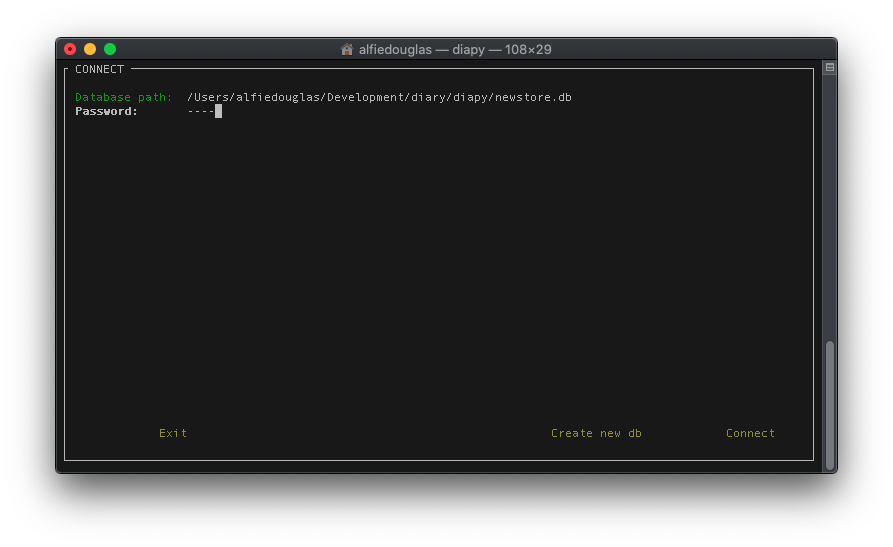
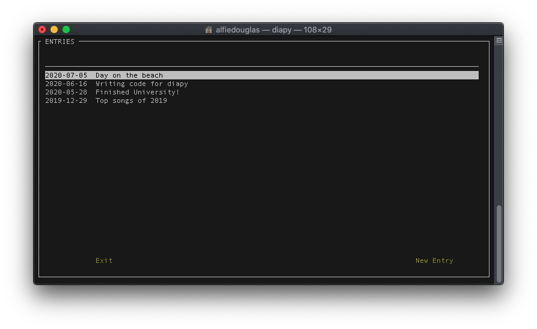
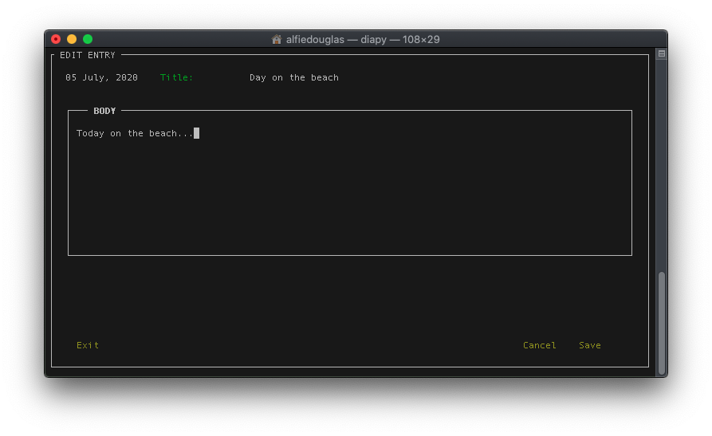

# `diapy`
(Last updated at commit #10)

`diapy` is a super light weight diary/journal editor written in `Python`. This stores all entries in an encrypted `SQLite` database using `sqlcipher3`.

### Dependencies
- `sqlcipher`  -  https://github.com/sqlcipher/sqlcipher

   Installation details are in the [README.md](https://github.com/sqlcipher/sqlcipher/blob/master/README.md) of the repository, but in short it can be installed with:
   - `homebrew` (macOS):
     ```sh 
     $ brew install sqlcipher
     ```
    - `apt-get` (Debian)
      ``` sh
      $ sudo apt-get install sqlcipher 
      ```
     

### Installation

```sh
$ git clone https://github.com/alfiedouglas0/diapy.git
$ cd diapy
$ ./install.sh
```

### Usage

As installed with `pip` it should be in your `$PATH`, so simply invoke with:

```sh
$ diapy
```

### Screenshots 

Landing screen:

Browse entries:

Edit existing / new entry: 



### Project Ideas / TODO
  - A richer UI
    - Preview given for each entry when browsing the list of entries
    - Organise each diary entry by month
  - Implement searching, sorting & filtering of entries
  - Each post can have tags associated with it
  - NLP analyses could be taken for each month/year to give a summary of the time period, such as the sentiment score, frequent words etc
  - Integrate a `git` wrapper for the DB folder, so it could be both backed up and synced with GitHub

